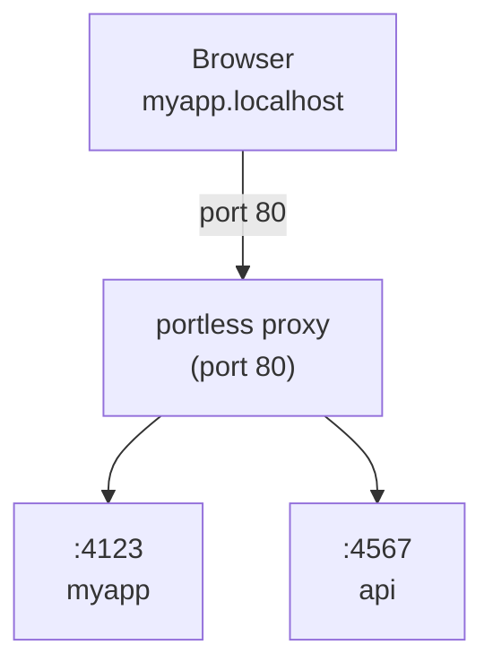

# portless

Replace port numbers with stable, named .localhost URLs. For humans and agents.

```diff
- "dev": "next dev"              # http://localhost:3000
+ "dev": "portless myapp next dev"  # http://myapp.localhost
```

## Quick Start

```bash
# Install
npm install -g portless

# Start the proxy (once, requires sudo for port 80)
sudo portless proxy

# Run your app
portless myapp next dev
# → http://myapp.localhost
```

> When run directly in your terminal, portless can auto-start the proxy for you (prompts for sudo once). Via package scripts, start the proxy manually first.

## Why

Local dev with port numbers is fragile:

- **Port conflicts** — two projects default to the same port and you get `EADDRINUSE`
- **Memorizing ports** — was the API on 3001 or 8080?
- **Refreshing shows the wrong app** — stop one server, start another on the same port, and your open tab now shows something completely different
- **Monorepo multiplier** — every problem above scales with each service in the repo
- **Agents test the wrong port** — AI coding agents guess or hardcode the wrong port, especially in monorepos
- **Cookie and storage clashes** — cookies set on `localhost` bleed across apps on different ports; localStorage is lost when ports shift
- **Hardcoded ports in config** — CORS allowlists, OAuth redirect URIs, and `.env` files all break when ports change
- **Sharing URLs with teammates** — "what port is that on?" becomes a Slack question
- **Browser history is useless** — your history for `localhost:3000` is a jumble of unrelated projects

Portless fixes all of this by giving each dev server a stable, named `.localhost` URL that both humans and agents can rely on.

## Usage

```bash
# Basic
portless myapp next dev
# → http://myapp.localhost

# Subdomains
portless api.myapp pnpm start
# → http://api.myapp.localhost

portless docs.myapp next dev
# → http://docs.myapp.localhost
```

### In package.json

```json
{
  "scripts": {
    "dev": "portless myapp next dev"
  }
}
```

Start the proxy once (`sudo portless proxy`), then just `pnpm dev`.

## How It Works



1. **Start the proxy** -- runs on port 80 by default in the background (requires sudo once)
2. **Run apps** -- `portless <name> <command>` assigns a free port and registers with the proxy
3. **Access via URL** -- `http://<name>.localhost` routes through the proxy to your app

Apps are assigned a random port (4000-4999) via the `PORT` environment variable. Most frameworks (Next.js, Vite, etc.) respect this automatically.

## Commands

```bash
portless <name> <cmd> [args...]  # Run app at http://<name>.localhost
portless list                    # Show active routes

# Disable portless (run command directly)
PORTLESS=0 pnpm dev              # Bypasses proxy, uses default port
# Also accepts PORTLESS=skip

# Proxy control
sudo portless proxy              # Start the proxy (port 80)
sudo portless proxy --port 8080  # Start the proxy on a custom port
sudo portless proxy stop         # Stop the proxy

# Options
--port <number>                  # Port for the proxy (default: 80)
                                 # Ports >= 1024 do not require sudo

# Info
portless --help                  # Show help
portless --version               # Show version
```

## Requirements

- Node.js 20+
- macOS or Linux
